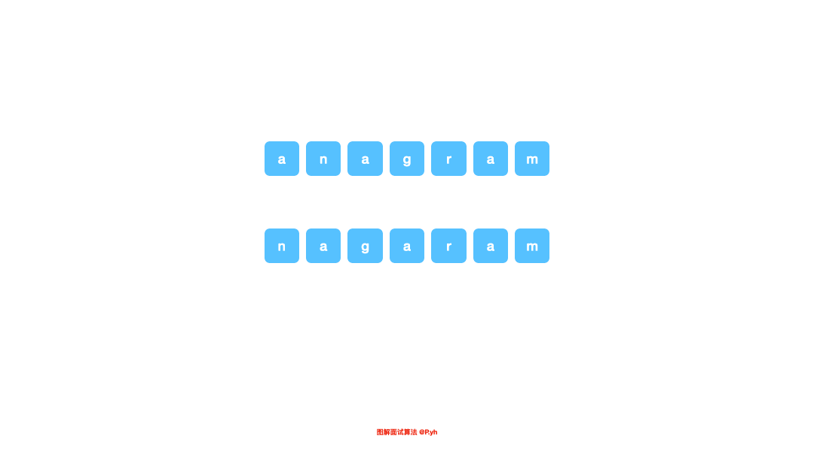

# LeetCode 第 242 号问题：有效的字母异位词

> 本文首发于公众号「图解面试算法」，是
> [图解 LeetCode ](https://github.com/MisterBooo/LeetCodeAnimation) 系列文章之一
> 。
>
> 同步博客：https://www.algomooc.com

题目来源于 LeetCode 上第 242 号问题：有效的字母异位词。题目难度为 Easy，目前通过
率为 60.5% 。

### 题目描述

给定两个字符串 s 和 t ，编写一个函数来判断 t 是否是 s 的字母异位词。

**示例 1:**

```
输入: s = "anagram", t = "nagaram"
输出: true
```

**示例 2:**

```
输入: s = "rat", t = "car"
输出: false
```

**说明：**

你可以假设字符串只包含小写字母。

**进阶：**

如果输入字符串包含 unicode 字符怎么办？你能否调整你的解法来应对这种情况？

### 题目解析

字母异位词的意思是，如果两个字符串互为字母异位词，那么两个字符串里的字符数量和种
类都一样，不一样的是每个字符出现的位置，以及先后顺序。最简单的方法是直接将字符串
按一定的规则排序，然后遍历对比即可。这种方法省空间，但是因为涉及到排序，时间复杂
度就是 `O(nlgn)`。

还有一个类似计数排序的方法，就是统计一个字符串里面所有字符对应的个数，然后再拿另
外一个字符串做对比，这么做可以把时间复杂度降到 `O(n)`，如果这道题目中的字符串仅
仅包含小写字母的话，我们可以开辟一个长度是 26 的数组，这样就不需要额外的空间，但
如果说输入的字符串包含 unicode 字符，由于 unicode 字符集过于庞大，常量级别的数组
变得不那么可取，我们可以考虑使用散列表这样的结构进行存储，逻辑是和之前一样的，但
是这里的空间复杂度就不再是 `O(1)`，而是 `O(n)`

<br>

### 代码实现（排序）

```java
public boolean isAnagram(String s, String t) {
    if ((s == null) || (t == null) || (t.length() != s.length())) {
        return false;
    }
    char[] sArr1 = s.toCharArray();
    char[] sArr2 = t.toCharArray();
    Arrays.sort(sArr1);
    Arrays.sort(sArr2);
    return Arrays.equals(sArr1, sArr2);
}
```

### 代码实现（哈希）

```java
public boolean isAnagram(String s, String t) {
    if ((s == null) || (t == null) || (t.length() != s.length())) {
        return false;
    }

    int n = s.length();

    Map<Character, Integer> counts = new HashMap<>();

    for (int i = 0; i < n; ++i) {
        counts.put(s.charAt(i), counts.getOrDefault(s.charAt(i), 0) + 1);
    }

    for (int i = 0; i < n; ++i) {
        counts.put(t.charAt(i), counts.getOrDefault(t.charAt(i), 0) - 1);
        if (counts.getOrDefault(t.charAt(i), -1) < 0) {
            return false;
        }
    }

    return true;
}
```

### 动画描述




